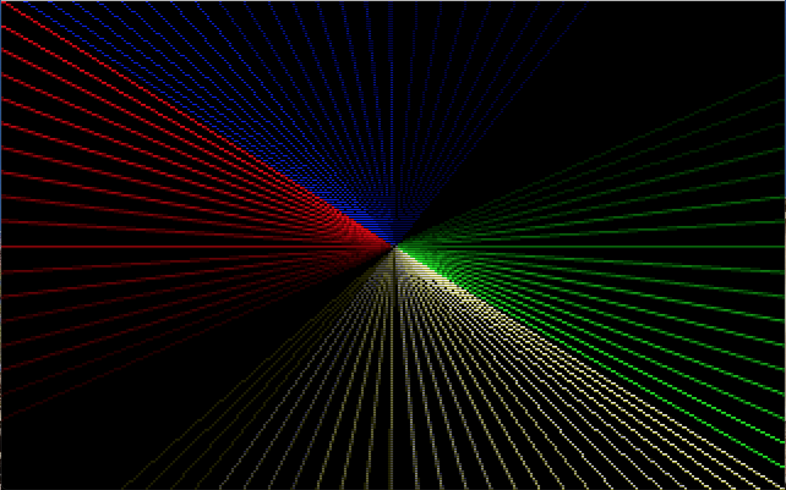

# Fast Lines
------------


## GFXLib
Included is a complete graphics library (with demos and screenshots) showcasing the line routines written for IBM PCs with a CGA, EGA, or VGA card:
[GFXLIB](https://github.com/dschmenk/Bresen-Span/tree/master/src/gfxlib/)

## Bresen-Span: A Span based Bresenham line routine
There are many computer graphics papers written about improving upon the standard Bresenham's line drawing algorithm to speed it up using horizontal and vertical spans of pixels, instead of the one-pixel-at-a-time approach. Often, the resulting algorithm seems more complicated than it needs to be. So I went back and wrote my own making as few changes to the original to keep it simple.

### Pixel-At-A-Time Bresenham
To start with, here is the simple, clean, and elegant algorithm as implemeted by Bresenham:

```
void line(int x1, int y1, int x2, int y2)
{
    int dx2, dy2, err, sx, sy, ps;

    sx = sy = 1;
    if ((dx2 = (x2 - x1) * 2) < 0)
    {
        sx  = -1;
        dx2 = -dx2;
    }
    if ((dy2 = (y2 - y1) * 2) < 0)
    {
        sy  = -1;
        dy2 = -dy2;
    }
    if (dx2 >= dy2)
    {
        if (sx < 0)
        {
            ps = x1; x1 = x2; x2 = ps;
            ps = y1; y1 = y2; y2 = ps;
            sy = -sy;
        }
        err = dy2 - dx2 / 2;
        while (x1 < x2)
        {
            pixel(x1, y1);
            if (err >= 0)
            {
                err -= dx2;
                y1  += sy;
            }
            err += dy2;
            x1++;
        }
    }
    else
      ... // Y major axis
    pixel(x2, y2);
}

```
I'm only going to show the X major axis code here, the Y axis is just reflected and present in the source file.

I will assume there are no questions about the baseline Bresenham line algorithm. However, take note that the algorithm can be viewed as the long division of delta-major/delta-minor. The error term is really the running remainder, and every step results in a pixel along the major axis until the division completes with a remainder. The division restarts by moving along the minor axis and adding the dividend back in to the running remainder (error term). This is a bit of a simplification, but the concept is that the long division will only result in two integral spans of pixels, depending on the value of the running remainder (error term). We will take this in to account to write a routine that outputs spans based on the two span lengths: a short-span and a long-span.

### Span-At-A-Time Bresenham

We will start off looking very much like the standard algorithm:
```
void line(int x1, int y1, int x2, int y2)
{
    int dx2, dy2, err, sx, sy, ps;
    int shorterr, shortlen, longerr, longlen, halflen;

    sx = sy = 1;
    if ((dx2 = (x2 - x1) * 2) < 0)
    {
        sx  = -1;
        dx2 = -dx2;
    }
    if ((dy2 = (y2 - y1) * 2) < 0)
    {
        sy  = -1;
        dy2 = -dy2;
    }
    if (dx2 >= dy2)
    {
        if (sx < 0)
        {
            ps = x1; x1 = x2; x2 = ps;
            ps = y1; y1 = y2; y2 = ps;
            sy = -sy;
        }
        if (dy2 == 0)
        {
            hspan(x1, x2, y1);
            return;
        }
```
We have defined a few more variables that will be needed and there is an explicit check for a horizontal line. This avoid a division by zero in the next step:
```
        ps  = x1;
#ifdef FAST_MULDIV
        halflen = (dx2 / 2) / dy2; // Find first half-span length and error
        err     = (halflen + 1) * dy2 - dx2 / 2;
        x1     += halflen;
#else
        err = dy2 - dx2 / 2;
        while (err < 0) // Find first half-span length and error
        {
            err += dy2;
            x1++;
        }
#endif
```
A little explanation is in order. The Bresenham algorithm is quite clever in that it is symetrical. Remember when I said there were only two lengths of spans? I lied. The first and last spans are half length. The initial error term for the pixel-at-a-time Bresenham algorithm looks like this: `err = dy2 - dx2 / 2;` which initializes the error term to 0.5, thus starting half-way through the first span. In order to replicate this, the span-at-a-time algorithm calculates this half-span length with either division & multiplication if you have fast hardware for those operations, or a long division version if you don't. Once the half-span length has been calculated, time to figure out the long and short span values based on the half-span:
```
        longlen = (x1 - ps + 1) * 2; // Long-span length = half-span length * 2
        longerr = err * 2;
        if (longerr >= dy2)
        {
            longerr -= dy2;
            longlen--;
        }
        shortlen = longlen - 1; // Short-span length = long-span length - 1
        shorterr = longerr - dy2;
        err     += shorterr; // Do a short-span step
```
Yes, the span-at-a-time algorithm requires a bit more initial setup. This code was written for clarity, not flat out speed. If you were going to rewrite the algorithm, there are many tricks to be used to make it more efficient. An assembly language version could really improve upon the speed of this routine.

But now the initialization has been completed. Look at what happens next in the main loop:
```
        while (x1 < x2)
        {
            hspan(ps, x1, y1);
            y1 += sy;     // Move to next span
            ps  = x1 + 1; // Start of next span = end of previous span + 1
            if (err >= 0) // Short span
            {
                err += shorterr;
                x1  += shortlen;
            }
            else          // Long span
            {
                err += longerr;
                x1  += longlen;
            }
        }
        hspan(ps, x2, y2); // Final span
```
Bam! That's it.

## Not just for drawing lines

By using function pointers for the horizontal and vertical spans, the line routine can be used for generalized linear interpolation. Here are a few uses demonstrated in the GFX library:

* Convex polygon filling - accumulate the edges drawn through line() and fill the results using the horizontal span routine lifted from line(). Look at [gfxmode.c](https://github.com/dschmenk/Bresen-Span/tree/master/src/gfxlib/lib/GFXMODE.C) for an example using beginfill() and endfill().
* Interpolating between two values. Look at [gfx8.c](https://github.com/dschmenk/Bresen-Span/tree/master/src/gfxlib/lib/GFX8.C) for a simple example.
* Interpolating between values in 2D - can be used for stretching/shrinking an image. Call line() recursively, once for the vertical stretch/shrink, and again for the horizontal stretch/shrink. [Showpbm.c](https://github.com/dschmenk/Bresen-Span/tree/master/src/gfxlib/demos/SHOWPBM.C) has a sample implementation.

## And now for something completely different: Anti Aliased Lines

A fast anti-aliased line routine using Wu's algorithm. This is more of a DDA implementation than a pure Bresenham. Calculating the slope in a 16.16 fixed point format provides the alpha component for free:
```
void aaline(int x1, int y1, int x2, int y2)
{
    long inc, err;
    int dx, dy, sx, sy, tmp, alpha;

    sx = sy = 1;
    if ((dx = x2 - x1) < 0)
    {
        sx = -1;
        dx = -dx;
    }
    if ((dy = y2 - y1) < 0)
    {
        sy = -1;
        dy = -dy;
    }
    if (dx >= dy)
    {
        if (dy == 0)
        {
            sx > 0 ? hspan(x1, x2, y1) : hspan(x2, x1, y1);
            return;
        }
        inc   = ((long)dy << 16) / dx;
        err   = inc - 0x00008000L; // 0.5 in 16.16 fixed point
        alpha = err >= 0 ? 0 : 0x7F;
        while (x1 != x2)
        {
            aapixel(x1, y1, 0xFF^alpha);
            aapixel(x1, y1 + sy, alpha);
            if (err >= 0)
            {
                alpha = 0;
                err  += inc - 0x00010000L; // 1.0 in 16.16 fixed point
                y1   += sy;
            }
            else
            {
                alpha  = ((int)err >> 8) & 0xFF;
                err   += inc;
            }
            x1 += sx;
        }
        aapixel(x2, y2, 0xFF^alpha);
        aapixel(x2, y2 + sy, alpha);
    }
    else // Y major
    ...
}
```
